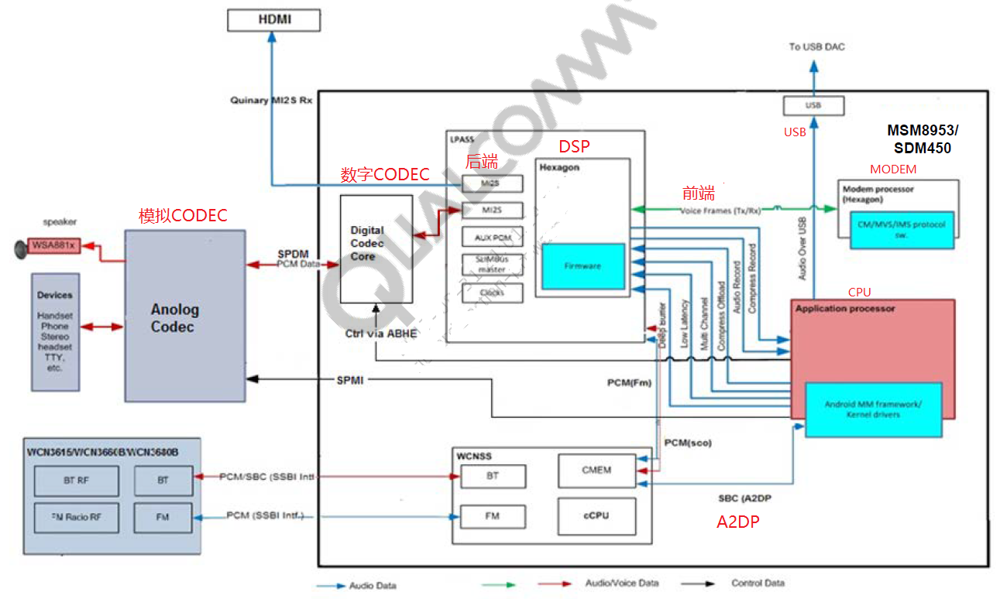

msm8953的音频架构如下图所示：



高通的音频架构，在底层采用前端(Front End)和后端(Back End)两个dai link进行控制。

前端和后端通过DSP连接。

前端处理方式介绍:

FE PCM种类如下：

playback的种类：  

* Offload playback

```
A large-sized buffer is sent to the aDSPand the APSS goes to sleep. The aDSPdecodes, applies postprocessing effects, and outputs the PCM data to the physical sound device. Before the aDSPdecoder input runs out of data, it interrupts the APSS to wake up and send the next set of buffers.

Supported formats –MP3, AC3, EAC3, AAC, 24bitPCM, 16-bitPCM, FLAC

Sampling rates in kHz –8, 11.025, 16, 22.05, 32, 44.1, 48, 64, 88.2, 96, 176.4, 192

Flags to be set in AudioTrack–AUDIO_OUTPUT_FLAG_DIRECT |AUDIO_OUTPUT_FLAG_COMPRESS_OFFLOAD |AUDIO_OUTPUT_FLAG_NON_BLOCKING

Supported channels –1, 2, 2.1, 4, 5, 5.1, 6, 7.1

```

* Deep buffer playback

音乐、视频等对时延要求不高的放音场景。

```
PCM data is sent to the aDSP, postprocessed, and rendered to an output sound device. Audio effects can also be appliedin the ARM or aDSP.

Use cases –Ringtone, audio/video playback, audio streaming, YouTube streaming, and so on.

Supported format –PCM

Sampling rates in kHz –44.1 and 48

Flag to be set in AudioTrack–AUDIO_OUTPUT_FLAG_PRIMARY

Supported channel –Stereo

```

* Low latency

按键音、触摸音、游戏背景音等低延时的放音场景

```
Playbackmode is similar to deep buffer, it uses a smaller buffer size and minimal or no postprocessing in the aDSPso that the PCM stream is rendered to the output sound device

Use cases –Touchtone, gaming audio, and so on.

Supported format –PCM

Sampling rates in kHz –44.1 and 48

Flag to be set in AudioTrack–AUDIO_OUTPUT_FLAG_FAST

Supported channel –Stereo
```

* Multichannel

```
Playback mode where the PCM output of the multichannel decoder is sent to the aDSP, postprocessed, and rendered at the output device

Examples –AAC 5.1 channel, Dolby AC3/eAC3 playback

Supported format –PCM

Sampling rates in kHz –44.1 and 48

Flag to be set in AudioTrack–AUDIO_OUTPUT_FLAG_DIRECT

Channels supported –6 (default); changes dynamically
```

* Playbackover A2DP and USB does not go through aDSP

recording

* Compress mode

Mode of recording where encoded packets are received bythe APSS directly from the ADSP; it is supported for AMR WB format only

* Nontunnelmode

Mode of recording where PCM data from the mic is preprocessed in DSP and received by the APSS, which then encodes the PCM to the required encoding format by using the DSP-based or software-based encoder

Examples include camcorder recording and in-call recording

* Multichannel mode

Used for capturing more than 2channels of the PCM stream and encoding them into a multichannel codec format like AC3

Examples include surround sound camcorder recording, 4 to 6 channel upsamplingfor 5.1 channel encoding

BE DAIs：

SLIM_BUS
Aux_PCM
Primary_MI2S
Secondary_MI2S
Tertiary_MI2S
Quatermary_MI2S